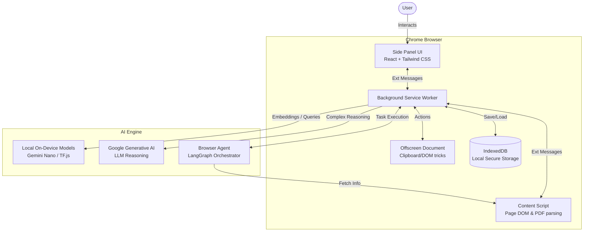

<div align="center">

# AI Pocket: Your Next-Gen Browsing Companion

[](https://chrome.google.com)
[](https://reactjs.org/)
[](https://vitejs.dev/)
[](https://aistudio.google.com/)
[](https://developer.chrome.com/docs/ai)

*Seamlessly blending generative AI, conversational assistance, and robust content management right into your browser.*

<br>

<!-- TODO: Insert Main Hero Image or Banner Below -->
<!--  -->

</div>

---

## What is AI Pocket?

**AI Pocket** transforms your daily browsing experience by bringing advanced artificial intelligence directly to your fingertips. Built with modern web technologies and powered by state-of-the-art models (including **on-device Gemini Nano**), it allows you to effortlessly understand, manage, and interact with the content you discover online.

Whether you're researching deep academic papers, summarizing lengthy articles, or managing complex data, AI Pocket provides an intuitive, chat-based interface to **get things done faster and smarter**.

---

## Demo

> **Watch AI Pocket in action**: See how easily you can understand pages, query PDFs, and trigger workflows.

<!-- TODO: Embed Demo Video (e.g., YouTube link or Local Animated GIF) -->
<!-- 
[](https://youtu.be/YOUR_VIDEO_ID) 
-->

---

## Core Features

- **Intelligent Page Understanding**: Automatically parses and understands the context of your active tab.
- **Context-Aware Chat**: Engage in natural dialogue with your AI assistant without copying and pasting.
- **Built-in Document Handling**: Analyze, summarize, and extract information from PDFs directly within your browser.
- **Local & Cloud Synergy**: Utilizes **local on-device ML** (TensorFlow.js & Gemini Nano) for high-speed, privacy-first processing, paired with powerful cloud LLMs for advanced reasoning.
- **Agentic Workflows**: Powered by **LangGraph**, it executes complex, multi-step actions autonomously.
- **Secure Local Storage**: All your data and embeddings are securely stored locally via IndexedDB.
- **Rich Markdown & Math**: Natively supports richly formatted markdown and LaTeX/KaTeX equations.

---

## Screenshots

<!-- TODO: Insert screenshots here to show off the UI and features -->
<details>
  <summary><b>Click to expand screenshots gallery</b></summary>
  <br>
  <!-- Replace paths below with actual images once uploaded to the repo -->
  <!--  -->
  <!--  -->
</details>

---

## Architecture Overview

AI Pocket utilizes a modern Chrome Extension Architecture built on React and Vite, heavily augmented with AI integrations.



---

## Project Directory Structure

```text
ai-ext/
├── ai-extension/        # Core extension (React + Vite)
│   ├── src/             
│   │   ├── background/  # Chrome Background Service Workers
│   │   ├── content/     # Content scripts (DOM parsing)
│   │   ├── sidepanel/   # React UI for the chat interface
│   │   ├── browser-agent/ # Autonomous Agent / LangGraph workflows
│   │   └── services/    # External/Internal APIs (Gemini, Local Models)
│   └── dist/            # Built Chrome extension package
├── playground/          # Isolated API & model test environments
└── dev-tools/           # Build and development scripts
```

---

## Setup & Installation Guidelines

### Prerequisites

To get the most out of **AI Pocket**, especially its local AI capabilities powered by **Gemini Nano**, you will need to use a specific version of Google Chrome.

1. **Install Chrome Dev or Canary**: Gemini Nano is currently available as an experimental feature in Google Chrome Developer or Canary channels.
   - [Download Chrome Dev](https://www.google.com/chrome/dev/)
   - [Download Chrome Canary](https://www.google.com/chrome/canary/)

### Setting up Gemini Nano

Once you have Chrome Dev or Canary installed, follow these steps to enable Gemini Nano (the built-in Prompt API):

1. **Open Chrome Flags**: Navigate to `chrome://flags/` in your browser.
2. **Enable Prompt API for Extensions**: Search for the flag `#prompt-api-for-extension` and set it to **Enabled**.
3. **Enable Optimization Guide On Device Model**: Search for `#optimization-guide-on-device-model` and set it to **Enabled BypassPrefRequirement**.
4. **Relaunch Chrome**: Click the "Relaunch" button at the bottom of the screen to apply the changes.
5. **Download the Model**: Go to `chrome://components/`, find **Optimization Guide On Device Model**, and click **Check for update** to ensure the Gemini Nano model is downloaded to your device.

### Installing the Extension

1. **Clone the Repository**:
   ```bash
   git clone https://github.com/0Cymantek0/ai-ext.git
   cd ai-ext
   ```
2. **Install Dependencies**:
   Ensure you have Node.js and npm installed, then run:
   ```bash
   npm install
   ```
3. **Build the Project**:
   ```bash
   npm run build
   ```
4. **Load into Chrome**:
   - Open Chrome and navigate to `chrome://extensions/`.
   - Turn on **Developer mode** in the top right corner.
   - Click **Load unpacked** and select the `dist` (or `build`) directory within the project folder.

---

## How to Use AI Pocket

1. **Activate the Extension**: Click on the AI Pocket icon in your Chrome extensions toolbar to open the AI side panel.
2. **Chat with the Page**: The AI automatically understands the context of your current active tab. Ask questions like "Summarize this article" or "What are the main points?".
3. **Query Documents**: You can upload PDFs or documents directly into the chat to extract insights or summarize complex information seamlessly.
4. **Run Agentic Workflows**: Ask the AI to perform complex multi-step tasks, and LangGraph will break it down and execute it for you.

Experience intelligent, seamless, and efficient browsing with AI Pocket!